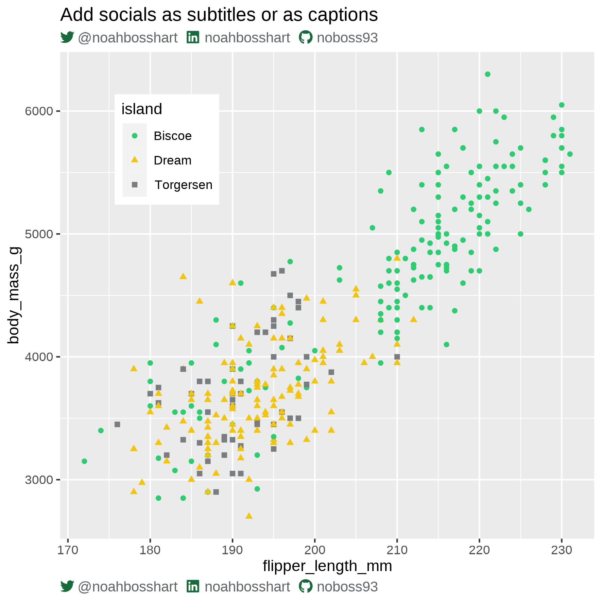

#### Helper Functions in R ####

1. socials_caption: Automatically adds socials to your ggplot2 subtitle or caption (supported socials: twitter, linkedin, github). Inspired by @tanya_shapiro[https://twitter.com/tanya_shapiro]

  

